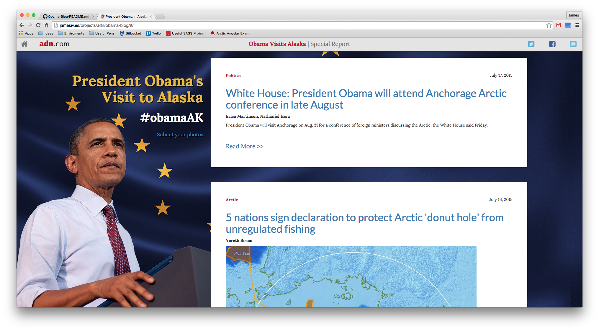

# Alaska Dispatch: Obama Visit Blog

Created for the ADN newsroom staff to post content related to President Barrack Obama's visit
to Alaska in August 2015.

## Installation

Installing the project can be done by running `npm install` and `bower install`.

## Usage

* Run `grunt build` for building and `grunt serve` for preview.
* Running `grunt test` will run the unit tests with Karma.

## Contributing

Additional details on how to contribute to a Git project can be [found here](https://guides.github.com/introduction/flow/).

1. Fork a branch.
2. Create your feature branch: `git checkout -b my-new-feature`
3. Commit your changes: `git commit -am 'Add some feature'`
4. Push to the branch: `git push origin my-new-feature`
5. Submit a pull request.

## Credits

The following frameworks and tools were used to create this project:

````
Bootstrap: http://getbootstrap.com
AngularJS: https://angularjs.org
jQuery: https://jquery.com
ngInfiniteScroll Directive: https://sroze.github.io/ngInfiniteScroll
Yeoman: http://yeoman.io
SASS: http://sass-lang.com
````


